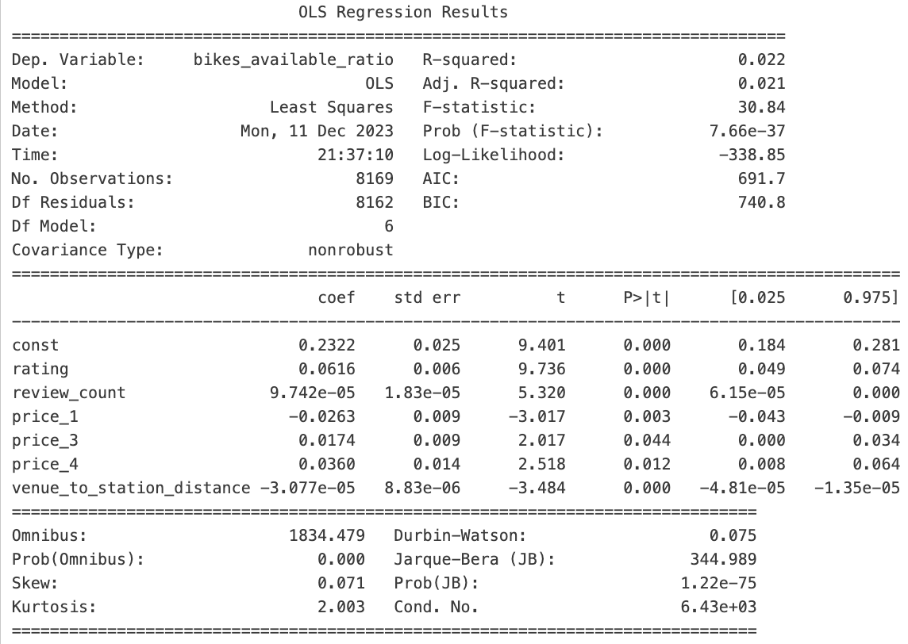

# Final-Project-Statistical-Modelling-with-Python

## Project/Goals
This project involves integrating various APIs, including CityBikes, Foursquare, and Yelp, to analyze bike-sharing data and the surrounding points of interest (POIs) such as restaurants and bars. The primary goals are:
- To understand and parse data from these APIs.
- To explore the relationship between bike station locations and nearby POIs.
- To build a statistical model demonstrating the correlation between the number of bikes at a station and the characteristics of nearby POIs.

## Process
### Part 1: CityBikes API
- Explored the CityBikes API to understand its structure and data format.
- Selected a city from the API and retrieved data for all bike stations in that city, including latitude, longitude, and number of bikes.
- Parsed the JSON data into a Pandas DataFrame for analysis.

### Part 2: Foursquare and Yelp APIs
- Connected to both Foursquare and Yelp APIs.
- Retrieved data on restaurants, bars, and various other POIs around each bike station in the chosen city.
- Created separate DataFrames for Yelp and Foursquare data and analyzed them for coverage quality.

### Part 3: Joining Data
- Merged the bike station data with the POI data from Yelp (chosen over Foursquare because of more data in categories of interest)
- Used data visualization techniques to explore relationships in the combined dataset.
- Created an SQLite database to store and structure the collected data.

### Part 4: Building a Model
- Developed a regression model to analyze the relationship between the availability of bikes at a station and the characteristics of nearby POIs.
- Interpreted the results of the model and extracted insights.
- Transformed the regression problem into a classification problem to perform multinomial logistics regression.

## Results
The comparative analysis of the API coverage revealed that Yelp returned more venues, and more data for each venue. The regression model provided insight into the characteristics of nearby venues, and the ratio of bikes available at the nearest bike station.
- Since price was an ordinal categorical variable, it was converted into dummy variables, each with their own column. Price_2 was set as the reference category, since it represented the vast majority of venues.

**Multivariate Regression Output**

#### Disccusion of Output

- Dependent Variable: The dependent variable for the model is bikes_available_ratio (total_bikes_available / total_slots)

 - R-squared: The R-squared value is 0.022, which means that approximately 2.2% of the variance in the bikes_available_ratio can be explained by the independent variables included in the model. This is a very low value, suggesting that the model does not explain much of the variability in the dependent variable.

- F-statistic: The F-statistic is 30.84 with a very low probability (p-value) of 7.66e-37, suggesting that the overall model is statistically significant.

- all independent variables have p-values below threshhold, therefore are statistically significant
##### Coefficients:

- The const coefficient indicates that the average bikes_available_ratio, when all other variables are zero, is 19.12%.
- rating has a positive effect on the bikes_available_ratio with a coefficient of 0.0616
- review_count shows a very small positive effect, higher review counts correlates with more bikes available
- price categories must be interpreted in relation to the reference category: price_2
    - price_1 has a negative coefficient, implying that a proximity to lower priced venues correlates with less bikes available
    - price_3, is positive, having a coefficient of 0.0174, immplying that proximity to higher priced venues correlates with more bikes available
    - price_4 continues the trend, its coeffient is double that of price_3, meaning that the highest priced venues are most strongly correlated with more bike availability
- venue_to_station_distance has a negative effect on the bikes_available_ratio, meaning that the higher its distance to nearby venues, the less bikes will be available at the station

##### Interpretation
Its possible to interpret bike availability in 2 contradicting ways:

1. A higher availability ratio is due to that station being LESS popular, implying that the nearby venues are LESS desirable.
2. A higher availability ratio is due to that station is MORE popular: customers frequently ride their bikes TO the area and dropping them off at that station, implying the nearby venues are MORE desirable.

- It becomes difficult to draw meaningful conclusions without more supporting data that would help determine which of these two scenarios is most likely.

- Additionally, one has to consider that the station data was a snapshot, representing the state of the bike stations at the time of the API call. The station data for this project was taken on 2023-12-09 @ 13:39:21. (2PM on a Saturday during winter). The inferences drawn from the bike station data must be considered in the context of day vs weekday, season, local weather, and time of day. These will all have a massive influence on whether the bike availability is representative of use patterns for patrons of nearby venues.

## Challenges 
- As outlined above, the nature of the model, and the contradicting possible interpretations for the dependent variable, made it difficult to draw meaningful conclusions from the regression.
- The predictor variables were very weak, there are other variables outside of the model and dataset that are influencing the dependent variable.

## Future Goals
Given more time, this project would benefit greatly from temporal analysis.
- Using the citybikes API to get data on bike availability over different days, times, months, weather conditions, provide much more data to potential find more meaningful correlations with the characteristics of the target POIs.